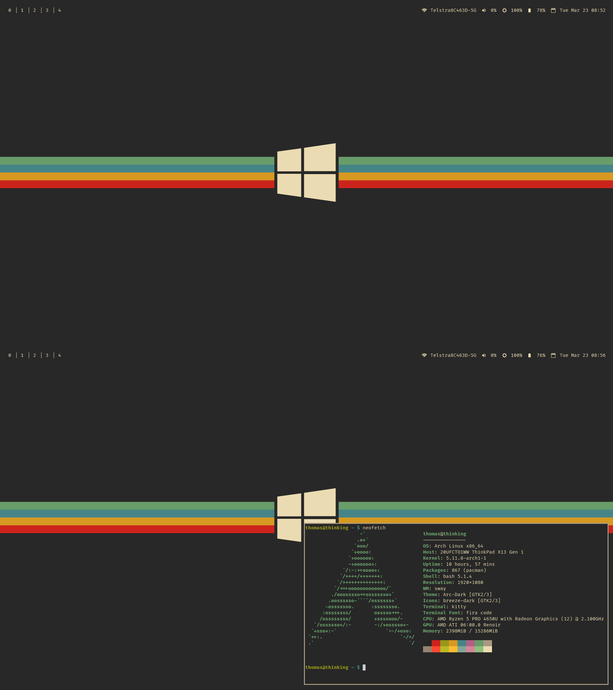

<h1>Welcome to my dotfiles</h1>

This is my current working rice for my desktop.

It's based around my favourite game: Destiny 2

<h2>Unique Features</h2>
<h3>Status Bar</h3>

My status bar is done by using a bash script to get all the information.

I wanted to use the built in swaybar rather than install something else such as waybar, as such there are a lot of limitations.

<h3>App Launcher</h3>

I wanted to try my hand at creating my own app launcher and decided to have a play around in bash.

Currently you can set short cuts to programs or use it as a file manager but otherwise you have to enter the programs full name

